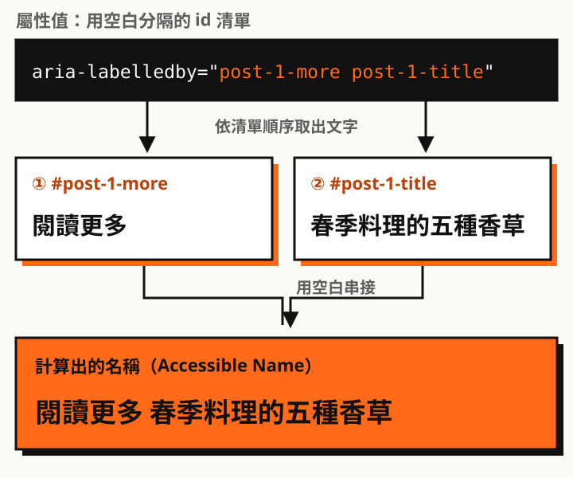
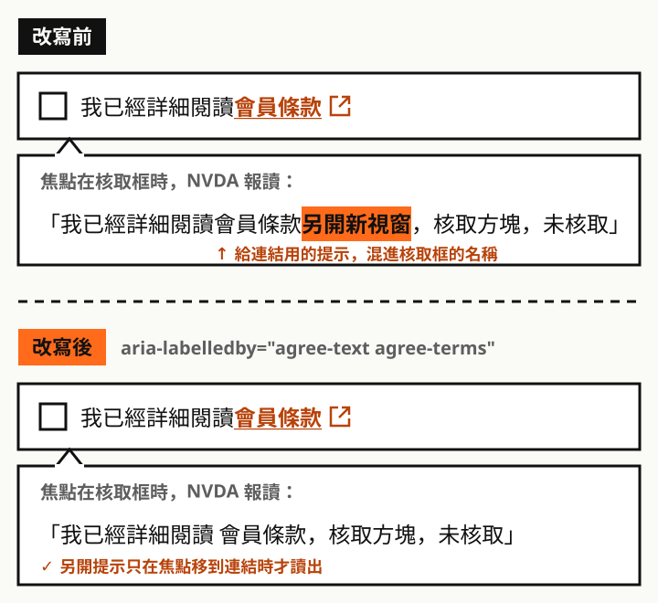

## 一個常被忽略的寫法

多數人寫 `aria-labelledby` 時只填一個 id，但它的值其實是**用空白分隔的 id 清單**。`aria-describedby` 也一樣。

```html
<button aria-labelledby="id-a id-b id-c">…</button>
```

瀏覽器會依照**清單的順序**，把每個元素的文字取出來、用空白串接，變成這個元件的名稱或說明。不需要額外寫隱藏文字，也不用重複內容。

## 用法一：讓「閱讀更多」有上下文

文章列表常見好幾個「閱讀更多」連結。螢幕閱讀器使用者用連結清單瀏覽時，只會聽到一串一模一樣的「閱讀更多」，分不出哪個是哪篇。

```html
<h3 id="post-1-title">春季料理的五種香草</h3>
<p>……</p>
<a href="/posts/spring-herbs/" id="post-1-more" aria-labelledby="post-1-more post-1-title">
  閱讀更多
</a>
```

計算出的名稱是「**閱讀更多 春季料理的五種香草**」。



注意清單裡**包含連結自己的 id**。`aria-labelledby` 會完全取代元素原本的文字，如果沒有把自己放進去，名稱就只剩文章標題，畫面上看到的「閱讀更多」反而不見了。保留可見文字也符合 WCAG 2.5.3「名稱包含標籤」，語音控制的使用者說「點擊閱讀更多」時才能對應到這個連結。

## 用法二：表格裡的操作按鈕

每一列都有「編輯」「刪除」按鈕時，可以把按鈕文字和該列的資料組合起來：

```html
<tr>
  <td id="row-7-name">範例商品 A</td>
  <td>
    <button id="row-7-del" aria-labelledby="row-7-del row-7-name">刪除</button>
  </td>
</tr>
```

讀出來是「**刪除 範例商品 A**」，而不是十個都叫「刪除」的按鈕。

## 用法三：欄位的提示加錯誤訊息

`aria-describedby` 很適合把多段輔助說明掛在同一個欄位上：

```html
<label for="pwd">密碼</label>
<input id="pwd" type="password" aria-describedby="pwd-hint pwd-error" aria-invalid="true">
<p id="pwd-hint">至少 8 個字元，需包含數字。</p>
<p id="pwd-error">密碼太短。</p>
```

焦點移到欄位時，會先讀名稱「密碼」，再讀說明「至少 8 個字元，需包含數字。密碼太短。」。錯誤修正後把 `pwd-error` 從清單移除，就不會繼續讀出過時的錯誤。

## 用法四：核取框標籤裡夾著另開連結

註冊或會員申請表單很常見這種寫法：

> ☐ 我已經詳細閱讀<u>會員條款</u>

「會員條款」是另開新視窗的連結，而且通常會附上「另開新視窗」的提示，可能是隱藏文字，也可能是一個 `alt="另開新視窗"` 的小圖示。

```html
<input type="checkbox" id="agree">
<label for="agree">
  我已經詳細閱讀
  <a href="/terms/" target="_blank" rel="noopener">
    會員條款<span class="visually-hidden">（另開新視窗）</span>
  </a>
</label>
```

問題是，核取框的名稱來自整個 `<label>` 的文字，連結裡的提示也會被算進去。用 NVDA 把焦點移到核取框時，會聽到類似「我已經詳細閱讀會員條款另開新視窗，核取方塊，未核取」。

「另開新視窗」是給**連結**用的資訊，放在核取框的名稱裡既冗長又讓人困惑：勾這個框會開新視窗嗎？

用 `aria-labelledby` 只挑需要的片段組成名稱：

```html
<input type="checkbox" id="agree" aria-labelledby="agree-text agree-terms">
<label for="agree">
  <span id="agree-text">我已經詳細閱讀</span>
  <a href="/terms/" target="_blank" rel="noopener">
    <span id="agree-terms">會員條款</span><span class="visually-hidden">（另開新視窗）</span>
  </a>
</label>
```



- 核取框的名稱變成「**我已經詳細閱讀 會員條款**」，不再包含另開提示
- 焦點移到連結時，仍然會讀出「會員條款（另開新視窗）」，提示只出現在真正需要的地方
- `<label for>` 繼續保留，點擊「我已經詳細閱讀」仍然可以勾選核取框；`aria-labelledby` 只覆蓋報讀出來的名稱

## 容易踩的坑

| 問題 | 說明 |
| --- | --- |
| 用逗號分隔 | `"a,b"` 會被當成一個叫 `a,b` 的 id，找不到就整個失效。只能用空白 |
| 拼錯屬性名稱 | 正確是 `labelledby`（兩個 l），寫成 `labeledby` 不會報錯，只會默默沒作用 |
| id 不存在 | 找不到的 id 會被直接略過，不會有任何警告 |
| 忘了放自己的 id | `aria-labelledby` 會蓋掉原本的文字，畫面上的字就從名稱裡消失了 |
| 說明太長 | 每次焦點進來都會完整讀一遍，只放真正需要的資訊 |
| 以為會一路往下追 | 被引用的元素如果自己也有 `aria-labelledby`，不會再往下串接 |

另外，被直接引用的元素即使是隱藏的（`hidden`、`display: none`），文字一樣會被計算。這可以拿來放只給輔助科技的補充說明，但也代表你不能靠「把它藏起來」來移除名稱的一部分。

## 怎麼驗證

1. 打開 Chrome 或 Firefox 的開發者工具，切到 **Accessibility** 面板，直接看元素的 **Computed Name** 和 **Description**
2. 用螢幕閱讀器實際聽一次（Windows 上的 NVDA、macOS 上的 VoiceOver）
3. 開啟連結清單或表單欄位清單，確認每一項都能單獨辨識

> 一句話記住：多個 id 用空白分隔，順序就是朗讀順序，記得把自己也放進去。
