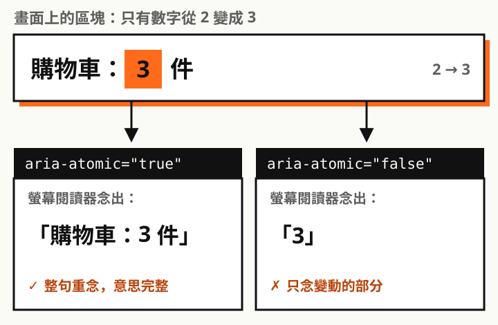
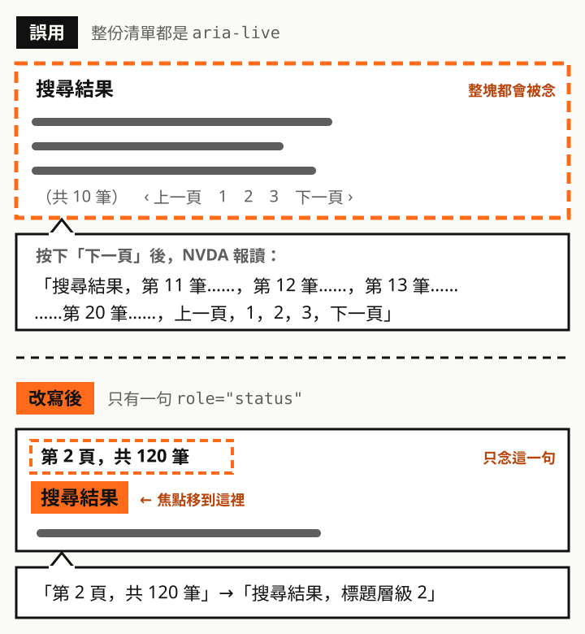

## 什麼是 live region

畫面上有些變化不會搶走焦點，例如「已加入購物車」、「儲存成功」、「密碼格式錯誤」。看得到螢幕的人一眼就發現了，但螢幕閱讀器使用者的焦點還停在原本的按鈕上，**沒人告訴他就不會知道**。

這就是 WCAG 4.1.3「狀態訊息」要解決的問題。做法是把會變動的區塊標成 **live region**，內容一改變，螢幕閱讀器就會主動念出來。

live region 的行為由三個屬性決定：

| 屬性 | 決定什麼 | 常用值 |
| --- | --- | --- |
| `role` | 這是什麼類型的訊息，並帶有預設的 `aria-live`、`aria-atomic` | `status`、`alert`、`log` |
| `aria-live` | **什麼時候念**：等使用者忙完，還是立刻插話 | `polite`、`assertive`、`off` |
| `aria-atomic` | **念多少**：整個區塊重念，還是只念有變動的部分 | `true`、`false` |

> 實務上很少需要三個都手動寫。選對 `role`，另外兩個就已經有合適的預設值。

## aria-atomic 的差別

`aria-atomic` 最容易被忽略，但它直接決定使用者聽到的是一句完整的話，還是一個沒頭沒尾的數字。



```html
<p role="status" aria-atomic="false">購物車：<span>3</span> 件</p>
```

數字從 2 變成 3 時，`aria-atomic="false"` 只會念「3」，使用者聽到一個數字，不知道它代表什麼。這時就該用 `true`，讓整句「購物車：3 件」重新念一次。

## 三大組合

| 組合 | 隱含的 aria-live | 隱含的 aria-atomic | 念的方式 | 適合 |
| --- | --- | --- | --- | --- |
| `role="status"` | `polite` | `true` | 等使用者忙完，整段念 | 成功訊息、筆數、進度 |
| `role="alert"` | `assertive` | `true` | 立刻插話，整段念 | 重要且需要馬上處理的錯誤 |
| `role="log"` | `polite` | `false` | 等使用者忙完，只念新增的 | 聊天訊息、操作紀錄 |

### 組合一：status，一般狀態訊息

最常用、也最不打擾使用者的組合。適合「告知結果」但不需要使用者立刻反應的訊息。

```html
<!-- 頁面載入時就存在，先保持空白 -->
<p id="cart-status" role="status"></p>

<script>
  // 加入購物車後，只更新文字
  document.querySelector('#cart-status').textContent = '已加入購物車，目前共 3 件';
</script>
```

使用者還在念別的東西時，訊息會排在後面，等他停下來才念。HTML 的 `<output>` 元素也隱含 `role="status"`，用在計算結果很方便。

### 組合二：alert，重要且緊急的訊息

`alert` 會**打斷**使用者目前在聽的內容，所以只留給真的要馬上處理的情況，例如：

- 送出表單後的錯誤摘要
- 「登入即將逾時，請在 60 秒內操作」
- 付款失敗

```html
<div id="form-error" role="alert"></div>
```

> W3C 把「對不重要、不緊急的內容使用 `role="alert"` 或 `aria-live="assertive"`」列為 4.1.3 的失敗案例。「儲存成功」不該用 alert，它應該是 status。

### 組合三：log，持續增加的紀錄

聊天室、通知中心、上傳進度紀錄這類**一直往下加內容**的區塊，用 `role="log"`。因為 `aria-atomic` 是 `false`，所以只念新加入的那一則，不會每次都從第一則重念。

```html
<ol role="log" aria-label="客服對話">
  <li>客服：您好，請問有什麼可以協助？</li>
  <!-- 新訊息 append 在這裡，只會念這一則 -->
</ol>
```

如果把聊天室錯用成 `role="status"`，每來一則新訊息，螢幕閱讀器就會把整個對話從頭念一次。

## 適用場景

| 場景 | 建議組合 | 念出的內容範例 |
| --- | --- | --- |
| 加入購物車、收藏 | `status` | 「已加入購物車，目前共 3 件」 |
| 自動儲存草稿 | `status` | 「草稿已於 14:32 儲存」 |
| 篩選、排序後結果更新 | `status` | 「共 36 筆結果」 |
| 「載入更多」追加資料 | `status` | 「已載入第 21 到 30 筆，共 120 筆」 |
| 上傳、匯出進度 | `status` | 「上傳完成 50%」（只在關鍵節點更新，不要每 1% 念一次） |
| 表單送出後的錯誤摘要 | `alert` | 「有 2 個欄位需要修正」 |
| 登入即將逾時 | `alert` | 「登入將在 60 秒後逾時」 |
| 付款、送出失敗 | `alert` | 「付款失敗，請重新確認卡片資料」 |
| 客服對話、聊天室 | `log` | 只念新進來的那一則 |
| 系統通知、操作紀錄 | `log` | 只念新增的那一筆紀錄 |

> 錯誤摘要如果會把焦點直接移過去，就不需要 `alert`，螢幕閱讀器會自己念出焦點所在的內容。兩個一起用反而會念兩次。

### 場景詳解：搜尋結果的換頁與不換頁

搜尋結果頁很常把兩種行為混在一起：

- **換頁**：送出關鍵字、點頁碼，整個頁面重新載入
- **不換頁**：勾選篩選條件、切換排序，只用 JavaScript 更新結果

兩種情況要讓使用者知道的事一樣（共幾筆、第幾頁），但通知的方式不同：

| 操作 | 頁面行為 | 怎麼讓使用者知道 | 焦點 |
| --- | --- | --- | --- |
| 送出搜尋、點頁碼 | 整頁重新載入 | `<title>` 與結果標題帶上筆數和頁數，目前頁碼加 `aria-current="page"`；不想改標題時，改用載入後的 `status` + `assertive` | 回到頁面頂端，由使用者自己導覽 |
| 勾選篩選、切換排序 | 不換頁，就地更新 | `role="status"` 念出「共 36 筆結果」 | **留在篩選控制項**，方便繼續調整條件 |
| 載入更多 | 不換頁，追加在後面 | `role="status"` 念出「已載入第 21 到 30 筆」 | 留在按鈕上，或移到新載入的第一筆 |

先分清楚一件事：**搜尋結果清單本身不是狀態訊息**，簡短的「共 36 筆結果」才是。W3C 在 4.1.3 的說明裡就是拿搜尋當例子；而整頁重新載入屬於換頁，也不在 4.1.3 的範圍內。

兩種行為可以共用同一個結構。伺服器輸出頁面時，就把筆數寫進標題和 status 容器；JavaScript 更新時，改的也是同一組元素：

```html
<title>搜尋：無障礙（第 2 頁，共 12 頁）｜網站名稱</title>

<!-- 篩選：不換頁 -->
<fieldset>
  <legend>篩選</legend>
  <label><input type="checkbox" name="type" value="article"> 文章</label>
  <label><input type="checkbox" name="type" value="video"> 影片</label>
</fieldset>

<!-- 頁面載入時就存在。整頁載入時不會被念出，只有之後的變化才會 -->
<p id="search-status" role="status">共 120 筆結果，第 2 頁</p>

<h2 id="results-title">搜尋結果</h2>
<ol id="results">…</ol>

<!-- 分頁：換頁，用一般連結 -->
<nav aria-label="分頁">
  <a href="?q=無障礙&page=1">1</a>
  <a href="?q=無障礙&page=2" aria-current="page">2</a>
  <a href="?q=無障礙&page=3">3</a>
</nav>
```

```js
// 篩選改變時：不換頁，就地更新
filters.addEventListener('change', async () => {
  const { total, html } = await fetchResults(currentQuery());
  results.innerHTML = html;                      // 清單本身不是 live region
  status.textContent = `共 ${total} 筆結果`;      // 只念這一句
  document.title = `搜尋：無障礙（共 ${total} 筆）｜網站名稱`;
  // 焦點留在剛剛勾選的核取框，使用者可以繼續調整
});
```

這個組合的好處：

- **換頁時**不依賴 live region，靠 `<title>` 和標題就能知道在第幾頁，沒有 JavaScript 也正常運作（不想改標題時，見下方的特殊用法）
- **不換頁時**只念一句話，不會把整份清單念出來，焦點也不會被搶走
- 筆數和頁數的文字只維護一份，換頁或不換頁都更新同樣的元素

如果分頁也改成不換頁（用 JavaScript 載入下一頁），使用者按「下一頁」通常就是想看結果，這時更適合**把焦點移到結果標題**（`tabindex="-1"` 再呼叫 `focus()`），讓他從第一筆往下讀，status 只負責補充「第 3 頁，共 120 筆」。



### 特殊用法：換頁重新載入，但不把頁數寫進標題

有時候 `<title>` 和結果標題要維持固定（例如設計規範或 SEO 的考量），不能加上「第 2 頁」。這時可以用 `role="status"` 搭配 `aria-live="assertive"`，在頁面載入後主動念出頁數：

```html
<!-- 先放空的容器，伺服器把要念的文字放在 data 屬性 -->
<p id="page-status" class="visually-hidden"
   role="status" aria-live="assertive"
   data-message="搜尋結果第 2 頁，共 120 筆"></p>
```

```js
// 頁面載入完成後才填入文字，這樣才算「變化」而被念出
window.addEventListener('load', () => {
  const el = document.querySelector('#page-status');
  setTimeout(() => { el.textContent = el.dataset.message; }, 500);
});
```

為什麼這樣組合：

- **`role="status"`**：語意上它仍然是狀態訊息，不是錯誤或警告，所以不用 `alert`
- **`aria-live="assertive"`**：明確寫出的 `aria-live` 會蓋過 `status` 隱含的 `polite`。頁面重新載入時，螢幕閱讀器通常會開始自動朗讀頁面內容，用 `polite` 的話，訊息可能排在後面很久才念、甚至被略過；改成 `assertive` 才能在一開始就讓使用者知道「已經換到第 2 頁」
- **載入後才填文字**：頁面載入時就已經存在的內容不會被當成變化。容器要先保持空白，等頁面載入完成再填入，稍微延遲一下也能避開螢幕閱讀器剛開始讀頁面的那一刻
- **視覺隱藏**：畫面上已經有頁碼和 `aria-current="page"`，這句話只給螢幕閱讀器使用者

需要注意：

- 只在**從分頁連結過來**時才放 `data-message`，第一次進入搜尋頁就不需要念
- `assertive` 會打斷正在念的內容，訊息要短，一句話就好
- 不同螢幕閱讀器在頁面載入時的行為不一樣，上線前請用 NVDA、JAWS、VoiceOver 實際測過，必要時調整延遲時間

## 常見陷阱

| 陷阱 | 說明 |
| --- | --- |
| 容器和內容一起插入 | 多數螢幕閱讀器只監聽已經存在的 live region。先放好空的容器，之後只改文字 |
| 用 `display: none` 隱藏容器 | 隱藏的區塊不會被念。只想給螢幕閱讀器聽，就用視覺隱藏（visually-hidden）的 CSS |
| 同樣的文字再設一次 | 內容沒有改變就不會觸發。連按兩次「加入購物車」時，可以先清空再設定，或讓文字帶上數量 |
| 把一大塊內容設成 live | 例如把整份搜尋結果、整個表單區塊包進 live region。區塊裡任何地方一變動就會觸發朗讀，加上 `status` 預設整段念，使用者會聽到整份清單從頭念到尾，中途很難打斷。live region 只包住「要通知的那一句話」，例如「共 36 筆」，其他內容放在外面 |
| 焦點已經移過去了還加 live | 4.1.3 只處理**沒有取得焦點**的變化。焦點移到新內容時，螢幕閱讀器本來就會念 |
| 所有訊息都用 alert | 使用者會一直被打斷，真正緊急的訊息反而被淹沒 |

## 怎麼驗證

1. 開啟 NVDA，按 `NVDA + N` → 工具 → **語音檢視器**，操作時看實際念出的文字
2. 觸發每一個狀態變化，確認有念、只念一次、內容完整
3. 一邊用方向鍵閱讀別的內容，一邊觸發變化，確認 `polite` 會排隊、`alert` 會插話
4. 換頁、篩選這類操作，檢查焦點落在哪裡，以及有沒有多念不必要的內容

> 一句話記住：status 告知、alert 示警、log 紀錄。只把「那一句話」設成 live，其他內容交給焦點和標題。
